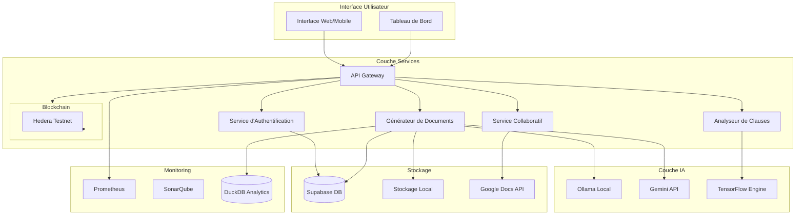

# Document de Conception - JusticeAutomation

## Vue d'ensemble

JusticeAutomation est une plateforme décentralisée qui combine l'intelligence artificielle et la blockchain pour démocratiser l'accès aux documents légaux à Madagascar. L'architecture adopte une approche hybride cloud/local pour garantir l'accessibilité même dans les zones à connectivité limitée.

## Architecture

### Architecture Globale



### Architecture de Déploiement

La plateforme utilise Docker pour le déploiement sur Ubuntu/Linux avec une approche microservices pour la scalabilité.

## Composants et Interfaces

### 1. Interface Utilisateur

**Technologies :** React.js avec PWA pour le support offline
**Responsabilités :**
- Interface de saisie en langage naturel pour la génération de contrats
- Tableau de bord de suivi des documents
- Interface d'édition collaborative
- Gestion des signatures numériques

**Interfaces clés :**
- `ContractGenerationInterface` : Saisie et génération de documents
- `DashboardInterface` : Vue d'ensemble des contrats utilisateur
- `CollaborativeEditorInterface` : Édition multi-utilisateur
- `SignatureInterface` : Processus de signature numérique

### 2. Service de Génération de Documents (DocGen)

**Technologies :** Node.js avec intégration Ollama et Gemini API
**Responsabilités :**
- Traitement des demandes en langage naturel
- Génération de documents conformes au droit malgache
- Gestion du mode offline/online
- Traduction multilingue

**Interfaces :**
```typescript
interface DocumentGenerator {
  generateContract(request: ContractRequest): Promise<LegalDocument>
  translateDocument(document: LegalDocument, language: Language): Promise<LegalDocument>
  validateCompliance(document: LegalDocument): Promise<ComplianceReport>
}
```

### 3. Analyseur de Clauses (ClauseAnalyzer)

**Technologies :** TensorFlow.js avec modèles pré-entraînés
**Responsabilités :**
- Détection automatique des clauses abusives
- Analyse des risques juridiques
- Suggestions de corrections

**Interfaces :**
```typescript
interface ClauseAnalyzer {
  analyzeDocument(document: LegalDocument): Promise<AnalysisResult>
  detectAbusiveClauses(clauses: Clause[]): Promise<RiskAssessment[]>
  suggestCorrections(risks: RiskAssessment[]): Promise<Suggestion[]>
}
```

### 4. Service Blockchain

**Technologies :** Hedera SDK avec fallback Polygon
**Responsabilités :**
- Enregistrement immuable des signatures
- Génération de preuves cryptographiques
- Vérification d'authenticité

**Interfaces :**
```typescript
interface BlockchainService {
  recordSignature(signature: DigitalSignature): Promise<BlockchainRecord>
  verifySignature(recordId: string): Promise<VerificationResult>
  generateProof(document: LegalDocument): Promise<CryptographicProof>
}
```

### 5. Service Collaboratif

**Technologies :** Google Docs API avec WebSocket pour temps réel
**Responsabilités :**
- Édition simultanée multi-utilisateur
- Synchronisation en temps réel
- Gestion des versions et historique

## Modèles de Données

### Document Légal
```typescript
interface LegalDocument {
  id: string
  type: DocumentType
  content: string
  language: Language
  status: DocumentStatus
  parties: Party[]
  clauses: Clause[]
  signatures: DigitalSignature[]
  blockchainRecord?: BlockchainRecord
  createdAt: Date
  updatedAt: Date
}
```

### Signature Numérique
```typescript
interface DigitalSignature {
  id: string
  documentId: string
  signerId: string
  signature: string
  timestamp: Date
  ipAddress: string
  blockchainHash?: string
}
```

### Analyse de Risque
```typescript
interface RiskAssessment {
  clauseId: string
  riskLevel: RiskLevel
  riskType: RiskType
  description: string
  suggestions: Suggestion[]
  confidence: number
}
```

## Gestion des Erreurs

### Stratégie de Résilience

1. **Mode Dégradé :** En cas de panne des services cloud, basculement automatique vers Ollama local
2. **Fallback Blockchain :** Si Hedera est indisponible, utilisation de Polygon Testnet
3. **Cache Local :** Stockage local des documents en cours pour éviter la perte de données
4. **Retry Logic :** Mécanisme de retry automatique avec backoff exponentiel

### Gestion des Erreurs par Service

**Générateur IA :**
- Timeout après 30 secondes avec message d'erreur explicite
- Fallback vers modèle local si API cloud échoue
- Validation du contenu généré avant présentation

**Service Blockchain :**
- Vérification de la connectivité avant enregistrement
- Queue des transactions en cas de panne temporaire
- Notification utilisateur en cas d'échec d'enregistrement

**Base de Données :**
- Transactions atomiques pour la cohérence des données
- Backup automatique quotidien
- Synchronisation différée en cas de panne réseau

## Stratégie de Test

### Tests Unitaires
- Couverture minimale de 80% pour les services critiques
- Tests des algorithmes de détection de clauses abusives
- Validation des modèles de données

### Tests d'Intégration
- Tests des API externes (Gemini, Google Docs, Hedera)
- Tests de la synchronisation offline/online
- Validation des workflows de signature

### Tests de Performance
- Tests de charge pour 1000 utilisateurs simultanés
- Temps de réponse < 30 secondes pour la génération de documents
- Tests de résilience en cas de panne de services

### Tests de Sécurité
- Audit des smart contracts avec SonarQube
- Tests de pénétration sur l'authentification
- Validation de l'intégrité des signatures blockchain

## Considérations de Sécurité

### Authentification et Autorisation
- Authentification multi-facteurs via Supabase
- Tokens JWT avec expiration courte
- Chiffrement des données sensibles au repos et en transit

### Protection des Données
- Conformité RGPD pour les données personnelles
- Anonymisation des données analytiques
- Chiffrement bout-en-bout pour les documents sensibles

### Sécurité Blockchain
- Validation des smart contracts avant déploiement
- Audit régulier des transactions
- Mécanisme de révocation des signatures compromises

## Monitoring et Observabilité

### Métriques Clés
- Temps de génération des documents
- Taux de détection des clauses abusives
- Disponibilité des services externes
- Nombre de signatures blockchain par jour

### Alertes Automatiques
- Indisponibilité des services critiques
- Temps de réponse > 30 secondes
- Échecs de signature blockchain
- Détection d'activité suspecte

### Analytics Utilisateur
- Utilisation de DuckDB pour l'analyse des patterns d'usage
- Dashboard de métriques business
- Rapports de conformité automatisés