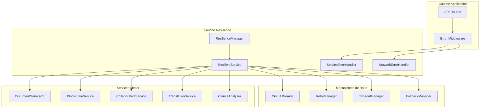

# Système de Résilience et Gestion d'Erreurs - JusticeAutomation

## Vue d'ensemble

Le système de résilience de JusticeAutomation implémente une approche complète de gestion d'erreurs avec des mécanismes de fallback, de retry avec backoff exponentiel, de gestion des timeouts, et de messages d'erreur utilisateur explicites. Ce système garantit la continuité de service même en cas de défaillance des composants individuels.

## Architecture du Système

### Composants Principaux

1. **ResilienceManager** - Coordinateur central de tous les mécanismes de résilience
2. **ResilientService** - Wrapper de service avec support complet de la résilience
3. **ServiceErrorHandler** - Gestionnaire d'erreurs spécifique à chaque service
4. **NetworkErrorHandler** - Gestionnaire spécialisé pour les erreurs réseau
5. **Circuit Breaker** - Implémentation du pattern circuit breaker
6. **RetryManager** - Gestionnaire de retry avec backoff exponentiel
7. **TimeoutManager** - Gestionnaire de timeouts avec fallback

### Diagramme d'Architecture



## Fonctionnalités Clés

### 1. Circuit Breaker Pattern

Le circuit breaker protège les services contre les cascades de défaillances :

- **États** : CLOSED (normal), OPEN (défaillant), HALF_OPEN (test de récupération)
- **Seuil de défaillance** : Configurable par service (3-5 échecs)
- **Timeout de reset** : 60 secondes par défaut
- **Fallback automatique** : Exécution des services de secours

```javascript
// Configuration par service
const serviceConfigs = {
    documentGenerator: {
        circuitBreakerThreshold: 5,
        resetTimeout: 60000
    },
    blockchain: {
        circuitBreakerThreshold: 3,
        resetTimeout: 120000
    }
};
```

### 2. Retry avec Backoff Exponentiel

Système de retry intelligent avec délais croissants :

- **Retry maximum** : 2-3 tentatives selon le service
- **Délai de base** : 1 seconde
- **Délai maximum** : 30 secondes
- **Jitter** : Randomisation pour éviter l'effet "thundering herd"
- **Erreurs retryables** : ETIMEDOUT, ECONNRESET, ENOTFOUND, etc.

```javascript
// Calcul du délai avec backoff exponentiel
delay = baseDelay * Math.pow(2, attempt);
delay = Math.min(delay, maxDelay);
if (jitter) {
    delay = delay * (0.5 + Math.random() * 0.5);
}
```

### 3. Gestion des Timeouts

Timeouts adaptatifs selon les conditions réseau :

- **Timeout par défaut** : 30 secondes
- **Timeout blockchain** : 45 secondes
- **Timeout collaboratif** : 20 secondes
- **Adaptation automatique** : Selon la qualité réseau détectée

### 4. Stratégies de Fallback

Chaque service dispose de stratégies de fallback spécifiques :

#### Document Generator
1. **Ollama → Gemini API** : Basculement cloud si service local indisponible
2. **Gemini → Templates** : Génération par modèles si APIs indisponibles
3. **Templates → Mode assisté** : Interface de saisie guidée

#### Blockchain
1. **Hedera → Polygon** : Basculement de réseau blockchain
2. **Polygon → Stockage local** : Sauvegarde locale avec sync différée
3. **Local → Queue** : Mise en file d'attente pour traitement ultérieur

#### Collaborative
1. **Google Docs → WebSocket local** : Édition collaborative locale
2. **WebSocket → Mode lecture** : Consultation avec sync manuelle
3. **Lecture → Téléchargement** : Export pour édition hors ligne

#### Translation
1. **IA → Dictionnaire** : Traduction basée sur dictionnaire
2. **Dictionnaire → Queue manuelle** : Mise en file pour traduction humaine
3. **Queue → Partielle** : Traduction partielle avec marquage

#### Clause Analyzer
1. **TensorFlow → Règles** : Analyse basée sur règles prédéfinies
2. **Règles → Validation de base** : Vérifications essentielles
3. **Validation → Marquage manuel** : Signalement pour révision

### 5. Messages d'Erreur Multilingues

Messages utilisateur explicites en français et malgache :

```javascript
const ErrorMessages = {
    NETWORK_ERROR: {
        fr: {
            title: 'Problème de connexion',
            message: 'Impossible de se connecter au service...',
            action: 'Réessayer dans quelques instants'
        },
        mg: {
            title: 'Olana amin\'ny fifandraisana',
            message: 'Tsy afaka mifandray amin\'ny serivisy...',
            action: 'Andramo indray afaka kelikely'
        }
    }
};
```

## Configuration des Services

### Paramètres de Résilience par Service

| Service | Timeout | Max Retries | Circuit Breaker | Health Check |
|---------|---------|-------------|-----------------|--------------|
| DocumentGenerator | 30s | 3 | 5 échecs | 60s |
| Blockchain | 45s | 2 | 3 échecs | 120s |
| Collaborative | 20s | 2 | 4 échecs | 90s |
| Translation | 15s | 3 | 5 échecs | 60s |
| ClauseAnalyzer | 25s | 2 | 4 échecs | 90s |
| Database | 10s | 3 | 5 échecs | 30s |

### Variables d'Environnement

```bash
# Timeouts (en millisecondes)
DEFAULT_TIMEOUT=30000
BLOCKCHAIN_TIMEOUT=45000
COLLABORATIVE_TIMEOUT=20000

# Circuit Breaker
CIRCUIT_BREAKER_THRESHOLD=5
CIRCUIT_BREAKER_RESET_TIMEOUT=60000

# Retry
MAX_RETRIES=3
RETRY_BASE_DELAY=1000
RETRY_MAX_DELAY=30000

# Capacité système
MAX_CONCURRENT_OPERATIONS=100
```

## API de Monitoring

### Endpoints de Santé

#### GET /api/resilience/health
Statut de santé global du système :

```json
{
  "success": true,
  "data": {
    "overall": {
      "status": "healthy",
      "healthPercentage": 100,
      "activeOperations": 5,
      "maxConcurrentOperations": 100
    },
    "services": {
      "documentGenerator": {
        "status": "healthy",
        "lastCheck": "2024-01-15T10:30:00Z"
      }
    },
    "circuitBreakers": {
      "documentGenerator": {
        "state": "CLOSED",
        "failureCount": 0
      }
    }
  }
}
```

#### GET /api/resilience/services
Statut détaillé de tous les services :

```json
{
  "success": true,
  "data": {
    "services": {
      "documentGenerator": {
        "service": "documentGenerator",
        "circuitBreaker": {
          "state": "CLOSED",
          "failureCount": 0,
          "lastFailureTime": null
        }
      }
    },
    "totalServices": 6
  }
}
```

#### GET /api/resilience/network-health
Santé de la connectivité réseau :

```json
{
  "success": true,
  "data": {
    "results": [
      {
        "url": "https://api.gemini.google.com",
        "status": "healthy",
        "responseTime": 150
      }
    ],
    "overallHealth": "healthy",
    "connectionStats": {
      "successful": 45,
      "failed": 2,
      "successRate": 96
    }
  }
}
```

### Endpoints d'Administration

#### POST /api/resilience/circuit-breakers/:service/reset
Reset manuel d'un circuit breaker (admin uniquement) :

```bash
curl -X POST /api/resilience/circuit-breakers/documentGenerator/reset \
  -H "Authorization: Bearer <admin-token>"
```

#### POST /api/resilience/degradation
Déclenchement manuel de dégradation système :

```bash
curl -X POST /api/resilience/degradation \
  -H "Authorization: Bearer <admin-token>" \
  -H "Content-Type: application/json" \
  -d '{"level": "moderate"}'
```

Niveaux de dégradation :
- **light** : Réduction légère des timeouts (90%)
- **moderate** : Réduction des timeouts (70%) + désactivation fonctions non-essentielles
- **severe** : Mode urgence - fonctionnalités de base uniquement (50%)

#### POST /api/resilience/recovery
Récupération de la dégradation :

```bash
curl -X POST /api/resilience/recovery \
  -H "Authorization: Bearer <admin-token>"
```

## Gestion des Erreurs par Type

### Erreurs Réseau

**Détection automatique** :
- ETIMEDOUT, ECONNRESET, ENOTFOUND
- Messages contenant "timeout", "network", "connection"

**Traitement** :
- Retry automatique avec backoff exponentiel
- Suggestions utilisateur contextuelles
- Adaptation des timeouts selon conditions réseau

**Messages utilisateur** :
```json
{
  "error": {
    "type": "NETWORK_ERROR",
    "title": "Problème de connexion",
    "message": "Impossible de se connecter au service...",
    "networkError": true,
    "retryRecommended": true,
    "estimatedRetryDelay": 5000,
    "suggestions": [
      "Vérifiez votre connexion internet",
      "Le service pourrait être temporairement surchargé"
    ]
  }
}
```

### Erreurs de Service

**Détection par patterns** :
- Patterns regex spécifiques par service
- Codes d'erreur connus
- Messages d'erreur caractéristiques

**Traitement** :
- Fallback automatique vers service alternatif
- Messages explicites sur l'état du fallback
- Recommandations d'actions utilisateur

**Messages utilisateur** :
```json
{
  "error": {
    "type": "AI_SERVICE_ERROR",
    "title": "Service IA temporairement indisponible",
    "serviceError": true,
    "serviceName": "documentGenerator",
    "severity": "medium",
    "retryable": true,
    "fallbackMessage": "Service IA local indisponible, utilisation du service cloud",
    "estimatedResolution": "5-15 minutes",
    "recommendations": [
      "Le service de secours est automatiquement activé",
      "Vos données sont préservées",
      "Réessayez votre demande"
    ],
    "troubleshooting": [
      "1. Le service de secours est automatiquement activé",
      "2. Vos données sont préservées",
      "3. Réessayez votre demande"
    ]
  }
}
```

### Erreurs d'Authentification

**Détection** :
- JsonWebTokenError, TokenExpiredError
- Codes HTTP 401, 403
- Messages contenant "unauthorized", "forbidden"

**Traitement** :
- Redirection vers page de connexion
- Nettoyage des tokens expirés
- Messages clairs sur l'action requise

### Erreurs de Validation

**Détection** :
- ValidationError
- Codes HTTP 400
- Données malformées

**Traitement** :
- Messages détaillés par champ
- Suggestions de correction
- Préservation des données valides

## Métriques et Observabilité

### Métriques Collectées

1. **Métriques de Performance** :
   - Temps de réponse par service
   - Nombre d'opérations actives
   - Taux de succès/échec

2. **Métriques de Résilience** :
   - États des circuit breakers
   - Nombre de retries par service
   - Utilisation des fallbacks

3. **Métriques Réseau** :
   - Latence réseau
   - Taux d'erreurs de connexion
   - Qualité de la connectivité

4. **Métriques Utilisateur** :
   - Types d'erreurs rencontrées
   - Temps de résolution
   - Satisfaction utilisateur

### Alertes Automatiques

1. **Alertes Critiques** :
   - Service principal indisponible > 5 minutes
   - Taux d'erreur > 50%
   - Circuit breaker ouvert > 10 minutes

2. **Alertes d'Avertissement** :
   - Taux d'erreur > 20%
   - Temps de réponse > 30 secondes
   - Utilisation fallback > 30%

3. **Alertes d'Information** :
   - Récupération de service
   - Fin de dégradation
   - Optimisations automatiques

## Bonnes Pratiques

### Pour les Développeurs

1. **Utilisation du ResilienceManager** :
```javascript
const resilienceManager = req.app.get('resilienceManager');
const result = await resilienceManager.executeOperation(
    'documentGenerator',
    async () => {
        // Votre opération ici
        return await generateDocument(request);
    },
    {
        operationName: 'generateContract',
        language: 'fr',
        context: { userId: req.user.id }
    }
);
```

2. **Gestion des Erreurs** :
```javascript
try {
    const result = await operation();
    return result;
} catch (error) {
    // L'erreur sera automatiquement traitée par le middleware
    throw error;
}
```

3. **Configuration des Services** :
```javascript
// Toujours configurer les timeouts appropriés
const service = new ResilientService('myService', {
    timeout: 30000,
    maxRetries: 3,
    circuitBreakerThreshold: 5
});
```

### Pour les Administrateurs

1. **Monitoring Régulier** :
   - Vérifiez `/api/resilience/health` quotidiennement
   - Surveillez les métriques de performance
   - Analysez les patterns d'erreurs

2. **Gestion des Incidents** :
   - Utilisez `/api/resilience/degradation` en cas de surcharge
   - Resetez les circuit breakers si nécessaire
   - Documentez les incidents pour amélioration

3. **Optimisation** :
   - Ajustez les timeouts selon l'usage
   - Configurez les seuils d'alerte
   - Planifiez les maintenances préventives

## Dépannage

### Problèmes Courants

1. **Circuit Breaker Ouvert** :
   - Vérifiez les logs du service concerné
   - Testez la connectivité réseau
   - Resetez manuellement si nécessaire

2. **Timeouts Fréquents** :
   - Augmentez les timeouts temporairement
   - Vérifiez la charge système
   - Optimisez les requêtes lentes

3. **Fallbacks Non Fonctionnels** :
   - Vérifiez la configuration des services de secours
   - Testez les APIs alternatives
   - Validez les clés d'authentification

### Commandes de Diagnostic

```bash
# Santé globale
curl /api/resilience/health

# État des circuit breakers
curl /api/resilience/circuit-breakers

# Santé réseau
curl /api/resilience/network-health

# Recommandations système
curl -H "Authorization: Bearer <token>" /api/resilience/recommendations
```

## Évolutions Futures

### Améliorations Prévues

1. **Machine Learning** :
   - Prédiction des pannes
   - Optimisation automatique des paramètres
   - Détection d'anomalies

2. **Résilience Avancée** :
   - Bulkhead pattern
   - Rate limiting adaptatif
   - Load balancing intelligent

3. **Observabilité** :
   - Tracing distribué
   - Métriques temps réel
   - Dashboards interactifs

4. **Automatisation** :
   - Auto-scaling
   - Self-healing
   - Déploiements canary

Cette documentation sera mise à jour régulièrement pour refléter les évolutions du système de résilience.